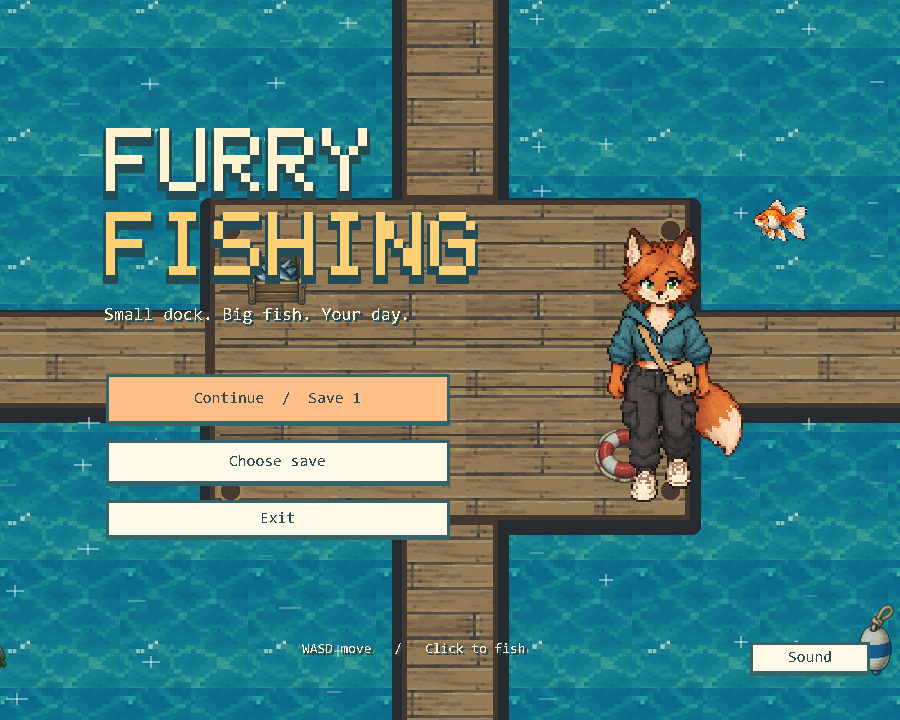
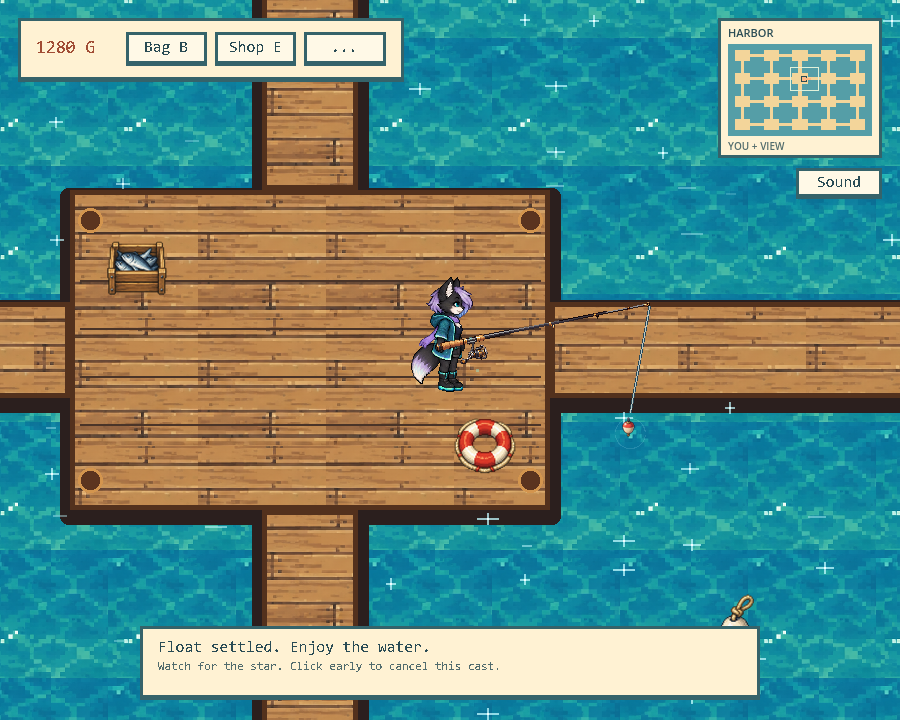
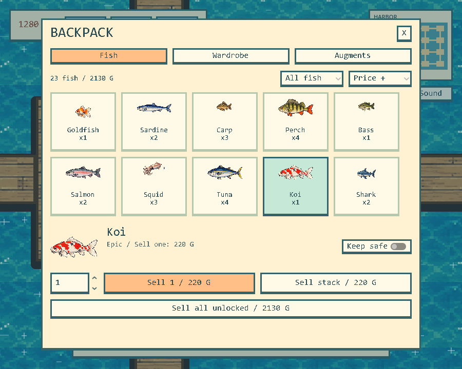
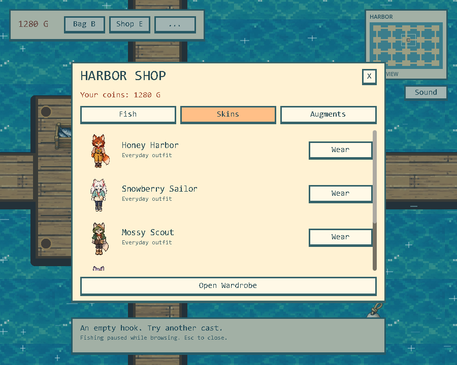
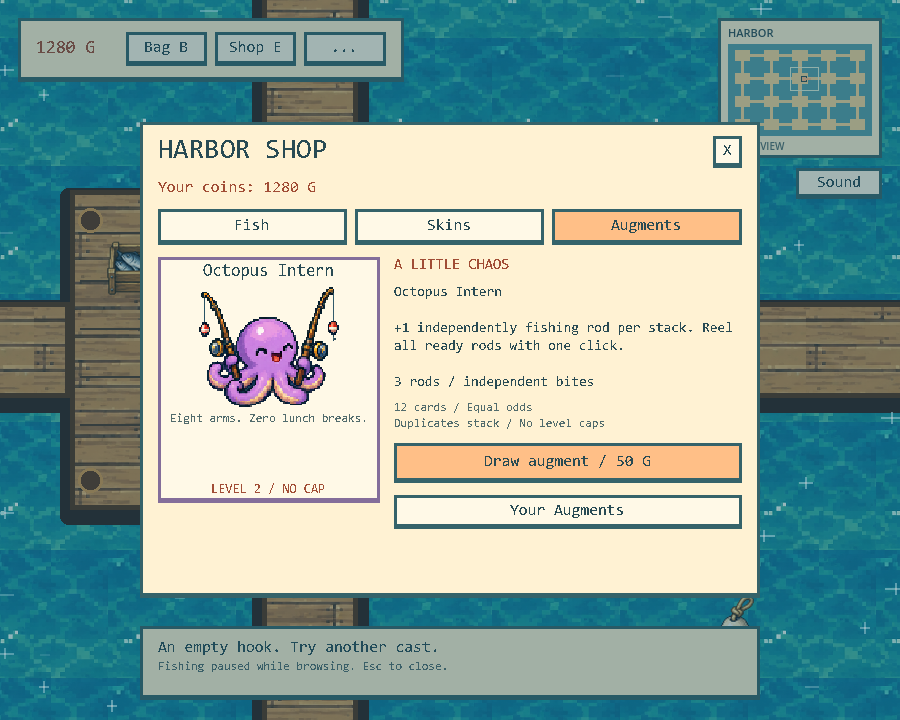

# Furry Fishing · 福瑞钓鱼

**Small dock. Big fish. Your day.**

A cozy single-player pixel-art fishing demo: cast a line, watch the shimmering harbor, and turn your catch into new outfits and wonderfully silly powers.

一款轻松的像素风单机钓鱼游戏：在码头散步、等待鱼儿上钩、出售渔获、换装，再抽一张有点离谱的 Augment。

## Download / 下载试玩

### [Download the Windows Demo v0.1 →](https://github.com/bobby018001/furry-fishing-demo/releases/tag/v0.1.0)

**Windows x64 · English in-game UI · Single-player · Early demo**

1. Open the release page above and expand **Assets**.
2. Download the game ZIP (about **57 MiB**), not GitHub's automatically generated **Source code** archives.
3. Extract the entire ZIP into a folder.
4. Run **Furry Fishing v0.1.exe**. Keep the accompanying `.pck` file beside it. The `.console.exe` launcher is optional and intended for diagnostics.

打开上面的下载页，在 **Assets** 下下载试玩 ZIP，**全部解压**后运行 `Furry Fishing v0.1.exe`。不要只取出 EXE，也不要下载自动生成的 Source code 压缩包。无需安装 Godot 或登录 GitHub。当前版本不适用于 macOS、手机或浏览器。



## A quiet harbor, a little chaos

- **Relaxed fishing:** cast, wait for the star, and reel in. No fishing minigame and no rush to click after a bite.
- **Ten distinct species:** from Goldfish and Sardine to Koi and Shark. Rarer fish sell for more and generally take longer to bite.
- **A connected harbor:** explore the docks with a following camera, shimmering water, decorations and a minimap.
- **A useful backpack:** stacked fish, protected catches, individual sales and sell-all confirmation.
- **Five purchasable outfits:** including white twin ponytails, golden sparkles and an aurora trail.
- **Twelve silly Augments:** spend in-game coins, draw a card, and stack powers without a gameplay level cap. Extra rods are only the beginning.
- **Two save slots**, an original chiptune soundtrack, and fishing/UI sound effects.

## In-game screenshots / 实机截图

These are unretouched runtime captures made from the **exact v0.1 resource pack included in the downloadable ZIP**, using its matching Godot engine. A separate demonstration save/state was used to show fish, unlocked outfits and an Augment; this progress is **not** bundled with the download. No concept art or mock UI is used here.

以下画面直接来自试玩包内的游戏资源。截图使用独立演示进度展示鱼类、已解锁服装与强化，不代表新存档一开始就拥有这些内容；下载包不包含个人存档。

### Cast a line at the harbor / 码头钓鱼



### Ten fish, one backpack / 十种鱼与背包



### Find your favorite look / 服装商店



### Hire an Octopus Intern / 抽一张搞怪强化



## Controls / 操作

| Input | Action |
| --- | --- |
| WASD / Arrow keys | Walk and face a direction / 移动、转向 |
| Left mouse button | Cast; click again after the star appears to reel in / 左键抛竿，出现星星后再按左键收杆 |
| B | Backpack, wardrobe and owned Augments / 背包、换装、强化 |
| E | Shop, outfit purchases and Augment draws / 商店、服装、抽卡 |
| Esc | Close a panel or return to the main menu / 关闭界面或回到主菜单 |

Reeling before a bite cancels the cast. Browsing the backpack or shop pauses fishing. Use **Sound** to adjust music and effects separately.

## Demo notes / 试玩说明

- This is an early demo; feedback on readability, controls and balance is welcome.
- Saves are stored locally on your computer, outside the ZIP. A fresh installation on another computer does not include the developer's progress. If you played an earlier build on the same computer, it may find your existing saves.
- Do not delete saves merely to test the game. Use an unused save slot if available.
- This build is not code-signed. Windows may show an unknown-publisher warning. Download only from a source you trust; do not disable your security software.
- This repository distributes the demo and screenshots, **not the editable Godot source project**.

## Feedback / 反馈

[Report a bug or share an idea](https://github.com/bobby018001/furry-fishing-demo/issues). Include the demo version, what happened, steps to reproduce it, and a screenshot if useful. Do not post passwords or personal save files.

## File integrity

Original archive: `Furry Fishing v0.1.zip` · **59,469,572 bytes**

SHA-256:

```text
AADA2883692A4CBBC346A8A9A3529E204EC928829D892D06F8C91B4D7C13005A
```

Built with Godot. This page and release use the creator-provided demo archive without repacking it.
